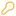

> **DO NOT EDIT THIS FILE, THE CONTENT IS AUTO-GENERATED.**

## Add new SVG Icon

1. put new svg files into `src/uikit/icons/raw`
2. run npm script `yarn gen:icon`

## Usage

```ts
import { Icon } from '@tidb-cloud-uikit/icons'

// with ts typing support!
<Icon name="SomeName" />
<Icon name="SomeName" size={20} color="red" />
```

## Preview

|                                 Preview                                | Name                 | Usage                                  |
| :--------------------------------------------------------------------: | :------------------- | :------------------------------------- |
|                    | AiExplore01          | `<Icon name="AiExplore01" />`          |
|                    | AlertCircle          | `<Icon name="AlertCircle" />`          |
|                | AlertTriangle        | `<Icon name="AlertTriangle" />`        |
|        | AlertTriangleFill    | `<Icon name="AlertTriangleFill" />`    |
|                    | AlignLeft01          | `<Icon name="AlignLeft01" />`          |
|                  | AlignRight01         | `<Icon name="AlignRight01" />`         |
|                        | ArrowDown            | `<Icon name="ArrowDown" />`            |
|                        | ArrowLeft            | `<Icon name="ArrowLeft" />`            |
|                      | ArrowRight           | `<Icon name="ArrowRight" />`           |
|                            | ArrowUp              | `<Icon name="ArrowUp" />`              |
|                              | Atom01               | `<Icon name="Atom01" />`               |
|                      | BarChart04           | `<Icon name="BarChart04" />`           |
|                      | BarChart07           | `<Icon name="BarChart07" />`           |
|                      | BarChart08           | `<Icon name="BarChart08" />`           |
|                | BarHorizontal        | `<Icon name="BarHorizontal" />`        |
|                    | BarVertical          | `<Icon name="BarVertical" />`          |
|                      | BookClosed           | `<Icon name="BookClosed" />`           |
|                      | BookOpen02           | `<Icon name="BookOpen02" />`           |
|                          | Brackets             | `<Icon name="Brackets" />`             |
|          | BracketsEllipses     | `<Icon name="BracketsEllipses" />`     |
|                      | Building05           | `<Icon name="Building05" />`           |
|                          | Calendar             | `<Icon name="Calendar" />`             |
|                                | Check                | `<Icon name="Check" />`                |
|                    | CheckCircle          | `<Icon name="CheckCircle" />`          |
|        | CheckCirclebroken    | `<Icon name="CheckCirclebroken" />`    |
|        | CheckSquareBroken    | `<Icon name="CheckSquareBroken" />`    |
|            | CheckVerified02      | `<Icon name="CheckVerified02" />`      |
|                    | ChevronDown          | `<Icon name="ChevronDown" />`          |
|            | ChevronDownFill      | `<Icon name="ChevronDownFill" />`      |
|                    | ChevronLeft          | `<Icon name="ChevronLeft" />`          |
|                  | ChevronRight         | `<Icon name="ChevronRight" />`         |
|          | ChevronRightFill     | `<Icon name="ChevronRightFill" />`     |
|                        | ChevronUp            | `<Icon name="ChevronUp" />`            |
|                                | Clock                | `<Icon name="Clock" />`                |
|                    | CodeBrowser          | `<Icon name="CodeBrowser" />`          |
|                  | CodeCircle02         | `<Icon name="CodeCircle02" />`         |
|                  | CodeCircle03         | `<Icon name="CodeCircle03" />`         |
|                            | Connect              | `<Icon name="Connect" />`              |
|                              | Copy01               | `<Icon name="Copy01" />`               |
|                              | Copy07               | `<Icon name="Copy07" />`               |
|  | CurrencyDollarCircle | `<Icon name="CurrencyDollarCircle" />` |
|                | CursorClick01        | `<Icon name="CursorClick01" />`        |
|                | DataApiSystem        | `<Icon name="DataApiSystem" />`        |
|                    | DataService          | `<Icon name="DataService" />`          |
|              | DataServiceAdd       | `<Icon name="DataServiceAdd" />`       |
|                          | Database             | `<Icon name="Database" />`             |
|                      | Database01           | `<Icon name="Database01" />`           |
|                      | Database03           | `<Icon name="Database03" />`           |
|                  | DatabseTable         | `<Icon name="DatabseTable" />`         |
|                      | Dataflow03           | `<Icon name="Dataflow03" />`           |
|                    | DotPoints01          | `<Icon name="DotPoints01" />`          |
|              | DotsHorizontal       | `<Icon name="DotsHorizontal" />`       |
|                  | DotsVertical         | `<Icon name="DotsVertical" />`         |
|                      | Download01           | `<Icon name="Download01" />`           |
|            | DownloadCloud01      | `<Icon name="DownloadCloud01" />`      |
|                              | DragIn               | `<Icon name="DragIn" />`               |
|                              | Edit03               | `<Icon name="Edit03" />`               |
|                              | Edit05               | `<Icon name="Edit05" />`               |
|                              | Eraser               | `<Icon name="Eraser" />`               |
|                          | Expand01             | `<Icon name="Expand01" />`             |
|                                    | Eye                  | `<Icon name="Eye" />`                  |
|                              | EyeOff               | `<Icon name="EyeOff" />`               |
|                    | FaceNeutral          | `<Icon name="FaceNeutral" />`          |
|                        | FaceSmile            | `<Icon name="FaceSmile" />`            |
|                              | File02               | `<Icon name="File02" />`               |
|                              | File06               | `<Icon name="File06" />`               |
|                  | FileImport02         | `<Icon name="FileImport02" />`         |
|              | FilterFunnel01       | `<Icon name="FilterFunnel01" />`       |
|                    | FilterLines          | `<Icon name="FilterLines" />`          |
|                        | Glasses01            | `<Icon name="Glasses01" />`            |
|                              | Grid01               | `<Icon name="Grid01" />`               |
|                        | HeartHand            | `<Icon name="HeartHand" />`            |
|                      | HelpCircle           | `<Icon name="HelpCircle" />`           |
|                          | HomeLine             | `<Icon name="HomeLine" />`             |
|                            | Inbox01              | `<Icon name="Inbox01" />`              |
|                                | Info2                | `<Icon name="Info2" />`                |
|                      | InfoCircle           | `<Icon name="InfoCircle" />`           |
|                                | Key02                | `<Icon name="Key02" />`                |
|            | LaygroundGrid02      | `<Icon name="LaygroundGrid02" />`      |
|                    | LayoutAlt03          | `<Icon name="LayoutAlt03" />`          |
|                  | LayoutBottom         | `<Icon name="LayoutBottom" />`         |
|          | LayoutBottomFill     | `<Icon name="LayoutBottomFill" />`     |
|                      | LayoutLeft           | `<Icon name="LayoutLeft" />`           |
|              | LayoutLeftFill       | `<Icon name="LayoutLeftFill" />`       |
|                    | LayoutRight          | `<Icon name="LayoutRight" />`          |
|            | LayoutRightFill      | `<Icon name="LayoutRightFill" />`      |
|                        | LayoutTop            | `<Icon name="LayoutTop" />`            |
|                | LayoutTopFill        | `<Icon name="LayoutTopFill" />`        |
|                  | LeftIndent01         | `<Icon name="LeftIndent01" />`         |
|                        | LineChart            | `<Icon name="LineChart" />`            |
|                | LineChartUp01        | `<Icon name="LineChartUp01" />`        |
|                              | Link03               | `<Icon name="Link03" />`               |
|              | LinkExternal01       | `<Icon name="LinkExternal01" />`       |
|                                  | List                 | `<Icon name="List" />`                 |
|                              | Lock01               | `<Icon name="Lock01" />`               |
|              | LockUnlocked01       | `<Icon name="LockUnlocked01" />`       |
|                          | LogOut03             | `<Icon name="LogOut03" />`             |
|                    | MediaGithub          | `<Icon name="MediaGithub" />`          |
|                    | MediaGoogle          | `<Icon name="MediaGoogle" />`          |
|              | MediaMicrosoft       | `<Icon name="MediaMicrosoft" />`       |
|                              | Menu01               | `<Icon name="Menu01" />`               |
|                          | MenuLeft             | `<Icon name="MenuLeft" />`             |
|                        | MenuRight            | `<Icon name="MenuRight" />`            |
|        | MessageChatSquare    | `<Icon name="MessageChatSquare" />`    |
|            | MessageSquare02      | `<Icon name="MessageSquare02" />`      |
|    | MessageTextSquare01  | `<Icon name="MessageTextSquare01" />`  |
|    | MessageTextSquare02  | `<Icon name="MessageTextSquare02" />`  |
|                      | Minimize01           | `<Icon name="Minimize01" />`           |
|                                | Minus                | `<Icon name="Minus" />`                |
|                                  | Moon                 | `<Icon name="Moon" />`                 |
|            | NotificationBox      | `<Icon name="NotificationBox" />`      |
|                          | Numberic             | `<Icon name="Numberic" />`             |
|                              | OpenAi               | `<Icon name="OpenAi" />`               |
|                    | PackagePlus          | `<Icon name="PackagePlus" />`          |
|          | ParagraphSpacing     | `<Icon name="ParagraphSpacing" />`     |
|                    | PauseCircle          | `<Icon name="PauseCircle" />`          |
|                      | PieChart03           | `<Icon name="PieChart03" />`           |
|                      | PlayCircle           | `<Icon name="PlayCircle" />`           |
|                                  | Plus                 | `<Icon name="Plus" />`                 |
|                      | PlusSquare           | `<Icon name="PlusSquare" />`           |
|                          | Question             | `<Icon name="Question" />`             |
|                    | RefreshCw01          | `<Icon name="RefreshCw01" />`          |
|                    | RefreshCw02          | `<Icon name="RefreshCw02" />`          |
|                    | RefreshCw04          | `<Icon name="RefreshCw04" />`          |
|                          | Repeat04             | `<Icon name="Repeat04" />`             |
|                                | Right                | `<Icon name="Right" />`                |
|                | RightIndent01        | `<Icon name="RightIndent01" />`        |
|                          | Rocket02             | `<Icon name="Rocket02" />`             |
|                                    | Run                  | `<Icon name="Run" />`                  |
|                            | RunFill              | `<Icon name="RunFill" />`              |
|                            | Scale02              | `<Icon name="Scale02" />`              |
|                            | Scale03              | `<Icon name="Scale03" />`              |
|                          | SearchLg             | `<Icon name="SearchLg" />`             |
|                              | Series               | `<Icon name="Series" />`               |
|                          | Server02             | `<Icon name="Server02" />`             |
|                          | Server05             | `<Icon name="Server05" />`             |
|                            | Service              | `<Icon name="Service" />`              |
|                      | Settings01           | `<Icon name="Settings01" />`           |
|                      | Settings02           | `<Icon name="Settings02" />`           |
|                          | Shield03             | `<Icon name="Shield03" />`             |
|                      | ShieldTick           | `<Icon name="ShieldTick" />`           |
|                      | ShieldUser           | `<Icon name="ShieldUser" />`           |
|                              | Star04               | `<Icon name="Star04" />`               |
|                          | String01             | `<Icon name="String01" />`             |
|                                    | Sun                  | `<Icon name="Sun" />`                  |
|      | SwitchHorizontal02   | `<Icon name="SwitchHorizontal02" />`   |
|          | SwitchVertical02     | `<Icon name="SwitchVertical02" />`     |
|              | SystemDatabase       | `<Icon name="SystemDatabase" />`       |
|                                | Tools                | `<Icon name="Tools" />`                |
|                            | Trash01              | `<Icon name="Trash01" />`              |
|                            | Types02              | `<Icon name="Types02" />`              |
|                | UploadCloud01        | `<Icon name="UploadCloud01" />`        |
|                      | UserCircle           | `<Icon name="UserCircle" />`           |
|                            | Users01              | `<Icon name="Users01" />`              |
|                          | Variable             | `<Icon name="Variable" />`             |
|                                  | Wifi                 | `<Icon name="Wifi" />`                 |
|                                | XAxis                | `<Icon name="XAxis" />`                |
|                            | XCircle              | `<Icon name="XCircle" />`              |
|                              | XClose               | `<Icon name="XClose" />`               |
|                                | YAxis                | `<Icon name="YAxis" />`                |
