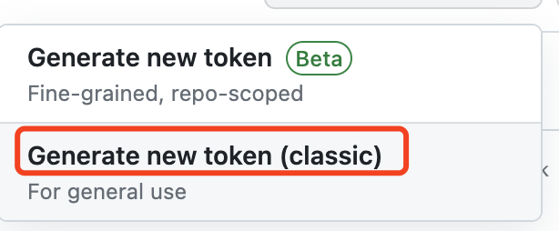
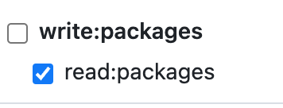
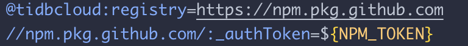

<p align="center">
  <a href="https://tidbcloud.com" target="_blank"></a>
</p>
<h1 align="center">TiDB Cloud UIKit</h1>

This repo is hosted TiDB Cloud UIKit including primitive, biz and pro components


## Table of Contents

- 📦 [Installation](#installation)
- 💻 [Usage](#usage)
- ⚙️ [Setup the repo](#setup-the-repo)
- 🛠️ [Development](#development)
- ✍️ [Make a pull request](#making-a-pull-request)
- 🚀 [Release](#release)


## How to use

### Installation
To use TiDBCloud UIKit, you need follow two steps

1. Change your registry. Beacuse we use github hosts the package, as accessing a private package, you need to setup the register for the uikit.

```bash
@tidbcloud:registry=https://npm.pkg.github.com
//npm.pkg.github.com/:_authToken=${NPM_TOKEN}
```
Paste above code into a file named `.npmrc`, replace the `${NPM_TOKEN}` with the token that you got from github, and place this file to your project's root path. How to generate the token, please follow the [Setup the repo](#setup-the-repo).

2. Install `@tidbcloud/uikit`

```bash
yarn add @tidbcloud/uikit

# or

npm i @tidbcloud/uikit
```

### Usage

To start using the components, you just need to:

```typescript
import { Card } from '@tidbcloud/uikit'
```

Now, we have follwing built-in components

|          Name        | Usage                     | Description | Status |
| :------------------: | :------------------------ | :-------| :------- |
| Primitive components from [mantine](https://v5.mantine.dev/) |  `import { Button } from '@tidbcloud/uikit'` |  Current using `mantine v5` as our basic library | ✅|
| CodeBlock | `import { CodeBlock } from '@tidbcloud/uikit'` | Display code with copy button | ✅ |
| BasicTable | `import { BasicTable } from '@tidbcloud/uikit'` | A table wrapped `mantine table` and `react-table`  | ✅  |
| ProTable | `import { ProTable } from '@tidbcloud/uikit'` | A table wrapped [mantine-react-table](https://www.mantine-react-table.com/)  | ✅  |
| PhoneInput | `import { PhoneInput } from '@tidbcloud/uikit'` | Phone input wrapped with [react-phone-input-2](https://bl00mber.github.io/react-phone-input-2.html)  | ✅  |
| SearchArea | `import { SearchArea } from '@tidbcloud/uikit'` | A component for search  | ✅  |
| Icons | `import { Icon, Inbox1 } from '@tidbcloud/uikit/icons'` | A component for icons  | ✅  |
| Dates | `import { DatePicker, Calendar, Month } from '@tidbcloud/uikit/dates'` | A component for date  | ✅  |
| Form | `import { Form, FormTextInput, FormNumberInput } from '@tidbcloud/uikit/form'` | A set of components for form, incluing `FormTextInput`, `FormNumberInput`, `FormCheckBox`, `Form`, `FormSelect`, `FormSwitch`, `FormTextArea`, `FormPasswordInput`, `Form.ErrorMessage`, `Form.Actions`, `FormMultiSelect` | ✅  |
| Carousel | `import { Carousel } from '@tidbcloud/uikit/carousel'` | Carousel component  | ✅  |
| Hooks | `import { useDebouncedValue } from '@tidbcloud/uikit/hooks'` | A set of hooks  | ✅  |
| Notifications | `import { notifier } from '@tidbcloud/uikit/notifications'` | A set of notifications  | ✅  |
| Modals | `import { openModal } from '@tidbcloud/uikit/modals'` | A set of modals  | ✅  |
| Dropzone | `import { Dropzone, DropzoneProps, IMAGE_MIME_TYPE } from '@tidbcloud/uikit/notifications'` | A set of notifications  | ✅  |
| Utils | `import { useHovered } from '@tidbcloud/uikit/utils'` | A set of utils  | ✅  |
| Prism | `import { Prism } from '@tidbcloud/uikit/prism'` | Highlight component  | ✅  |

## Contributing

### Setup the repo

Before developing

1. Make sure you've installed the [pnpm](https://pnpm.io/)
2. Clone the project & install the depenceis
3. Enter the root folder, and use blow command

```bash

cd ./tidbcloud-uikit/
cp .npmrc.sample .npmrc

```

4. Go to Github > Settings > Personal access token -> [Tokens(classic)](https://github.com/settings/tokens)

   a. Generate a new token(classic)
   

   b. Give the token `read:packages`
   

   c. Replace the symbol called `${NPM_TOKEN}` with your github token residing in `.npmrc`
   

### Development

#### Tools

- [PNPM](https://pnpm.io/) to manage packages and dependencies
- [Tsup](https://tsup.egoist.dev/) to bundle packages
- [Storybook](https://storybook.js.org/) for rapid UI component development and testing
- [Changeset](https://github.com/atlassian/changesets) for changes documentation, changelog generation, and release management.

#### Commands

- `pnpm install`: bootstraps the entire project, symlinks all dependencies for cross-component development and builds all components.
- `pnpm storybook`: starts storybook server and loads stories in files that end with .stories.tsx.
- `pnpm build`: run build for all component packages.
- `pnpm release`: publish changed packages.

#### Developing

Your working area is uikit and stories. Once you finish your coding in the uikit, please write some stories for testing.

### Making a pull request

#### Commit Convention

Before you create a Pull Request, please check whether your commits comply with the commit conventions used in this repository.
When you create a commit, you should follow the convention category(scope or module): message in your commit message while using one of the following categories:

- feat/feature: all changes that introduce completely new code or new features
  - For example: feat(uikit/components), feat(uikit/hooks)
- fix: changes that fix a bug (ideally you will additionally reference an issue if present)
- refactor: any code related change that is not a fix nor a feature
- chore: all changes to the repository that do not fit into any of the above categories

### PR

Once you've committed your message. You can do your PR

1. Make a changeset

```bash
pnpm changeset
```

2. Follow the changeset interactive prompts, commit your change

```bash
git commit -m 'feat(uikit): your message'
```

3. Push the changes, request a PR. Waiting for the review and merged with the master


### Release
Please make sure grant the permission of `write:packages` to your token in the Setup Repo step.

1. Update Version, using follow command update package version. Also, please follow the principle of Semver.

```bash
pnpm version-packages
```

2. Release to github packages. Execute below command will release to github packages

```
pnpm release
```

