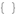

> **DO NOT EDIT THIS FILE, THE CONTENT IS AUTO-GENERATED.**

## Add new SVG Icon

1. put new svg files into `src/raw`
2. run npm script `yarn gen:icon`

## Usage

```ts
import { Icon } from '@tidbcloud/uikit-icons'

// with ts typing support!
<Icon name="SomeName" />
<Icon name="SomeName" size={20} color="red" />
```

## Preview

|                                Preview                                | Name                      | Usage                                       |
| :-------------------------------------------------------------------: | :------------------------ | :------------------------------------------ |
|                              | AiExplore01               | `<Icon name="AiExplore01" />`               |
|                              | AlertCircle               | `<Icon name="AlertCircle" />`               |
|                          | AlertTriangle             | `<Icon name="AlertTriangle" />`             |
|                  | AlertTriangleFill         | `<Icon name="AlertTriangleFill" />`         |
|                              | AlignLeft01               | `<Icon name="AlignLeft01" />`               |
|                            | AlignRight01              | `<Icon name="AlignRight01" />`              |
|                                  | ArrowDown                 | `<Icon name="ArrowDown" />`                 |
|                                  | ArrowLeft                 | `<Icon name="ArrowLeft" />`                 |
|                                | ArrowRight                | `<Icon name="ArrowRight" />`                |
|                                      | ArrowUp                   | `<Icon name="ArrowUp" />`                   |
|                                        | Atom01                    | `<Icon name="Atom01" />`                    |
|                                | BarChart04                | `<Icon name="BarChart04" />`                |
|                                | BarChart07                | `<Icon name="BarChart07" />`                |
|                                | BarChart08                | `<Icon name="BarChart08" />`                |
|                          | BarHorizontal             | `<Icon name="BarHorizontal" />`             |
|                              | BarVertical               | `<Icon name="BarVertical" />`               |
|                                | BookClosed                | `<Icon name="BookClosed" />`                |
|                                | BookOpen02                | `<Icon name="BookOpen02" />`                |
|                                    | Brackets                  | `<Icon name="Brackets" />`                  |
|                    | BracketsEllipses          | `<Icon name="BracketsEllipses" />`          |
|                                | Building05                | `<Icon name="Building05" />`                |
|                                    | Calendar                  | `<Icon name="Calendar" />`                  |
|                                          | Check                     | `<Icon name="Check" />`                     |
|                              | CheckCircle               | `<Icon name="CheckCircle" />`               |
|                  | CheckCirclebroken         | `<Icon name="CheckCirclebroken" />`         |
|                  | CheckSquareBroken         | `<Icon name="CheckSquareBroken" />`         |
|                      | CheckVerified02           | `<Icon name="CheckVerified02" />`           |
|                              | ChevronDown               | `<Icon name="ChevronDown" />`               |
|                      | ChevronDownFill           | `<Icon name="ChevronDownFill" />`           |
|                              | ChevronLeft               | `<Icon name="ChevronLeft" />`               |
|                            | ChevronRight              | `<Icon name="ChevronRight" />`              |
|                    | ChevronRightFill          | `<Icon name="ChevronRightFill" />`          |
|                                  | ChevronUp                 | `<Icon name="ChevronUp" />`                 |
|          | ChevronVerticalExpand     | `<Icon name="ChevronVerticalExpand" />`     |
|          | ChevronVerticalShrink     | `<Icon name="ChevronVerticalShrink" />`     |
|                                          | Clock                     | `<Icon name="Clock" />`                     |
|                              | CodeBrowser               | `<Icon name="CodeBrowser" />`               |
|                            | CodeCircle02              | `<Icon name="CodeCircle02" />`              |
|                            | CodeCircle03              | `<Icon name="CodeCircle03" />`              |
|                                      | Connect                   | `<Icon name="Connect" />`                   |
|                                        | Copy01                    | `<Icon name="Copy01" />`                    |
|                                        | Copy03                    | `<Icon name="Copy03" />`                    |
|                                        | Copy07                    | `<Icon name="Copy07" />`                    |
|            | CurrencyDollarCircle      | `<Icon name="CurrencyDollarCircle" />`      |
|                          | CursorClick01             | `<Icon name="CursorClick01" />`             |
|                          | DataApiSystem             | `<Icon name="DataApiSystem" />`             |
|                              | DataService               | `<Icon name="DataService" />`               |
|                        | DataServiceAdd            | `<Icon name="DataServiceAdd" />`            |
|                                    | Database                  | `<Icon name="Database" />`                  |
|                                | Database01                | `<Icon name="Database01" />`                |
|                                | Database03                | `<Icon name="Database03" />`                |
|                            | DatabseTable              | `<Icon name="DatabseTable" />`              |
|                                | Dataflow03                | `<Icon name="Dataflow03" />`                |
|                              | DotPoints01               | `<Icon name="DotPoints01" />`               |
|                        | DotsHorizontal            | `<Icon name="DotsHorizontal" />`            |
|                            | DotsVertical              | `<Icon name="DotsVertical" />`              |
|                                | Download01                | `<Icon name="Download01" />`                |
|                      | DownloadCloud01           | `<Icon name="DownloadCloud01" />`           |
|                                        | DragIn                    | `<Icon name="DragIn" />`                    |
|                                        | Edit03                    | `<Icon name="Edit03" />`                    |
|                                        | Edit05                    | `<Icon name="Edit05" />`                    |
|                                        | Eraser                    | `<Icon name="Eraser" />`                    |
|                                    | Expand01                  | `<Icon name="Expand01" />`                  |
|                                              | Eye                       | `<Icon name="Eye" />`                       |
|                                        | EyeOff                    | `<Icon name="EyeOff" />`                    |
|                              | FaceNeutral               | `<Icon name="FaceNeutral" />`               |
|                                  | FaceSmile                 | `<Icon name="FaceSmile" />`                 |
|                                        | File02                    | `<Icon name="File02" />`                    |
|                                        | File05                    | `<Icon name="File05" />`                    |
|                                        | File06                    | `<Icon name="File06" />`                    |
|                            | FileImport02              | `<Icon name="FileImport02" />`              |
|                        | FilterFunnel01            | `<Icon name="FilterFunnel01" />`            |
|                              | FilterLines               | `<Icon name="FilterLines" />`               |
|                                        | Github                    | `<Icon name="Github" />`                    |
|                                  | Glasses01                 | `<Icon name="Glasses01" />`                 |
|                                        | Grid01                    | `<Icon name="Grid01" />`                    |
|                                  | HeartHand                 | `<Icon name="HeartHand" />`                 |
|                                | HelpCircle                | `<Icon name="HelpCircle" />`                |
|                                    | HomeLine                  | `<Icon name="HomeLine" />`                  |
|                                      | Inbox01                   | `<Icon name="Inbox01" />`                   |
|                                          | Info2                     | `<Icon name="Info2" />`                     |
|                                | InfoCircle                | `<Icon name="InfoCircle" />`                |
|                                          | Key02                     | `<Icon name="Key02" />`                     |
|                      | LaygroundGrid02           | `<Icon name="LaygroundGrid02" />`           |
|                              | LayoutAlt03               | `<Icon name="LayoutAlt03" />`               |
|                            | LayoutBottom              | `<Icon name="LayoutBottom" />`              |
|                    | LayoutBottomFill          | `<Icon name="LayoutBottomFill" />`          |
|                                | LayoutLeft                | `<Icon name="LayoutLeft" />`                |
|                        | LayoutLeftFill            | `<Icon name="LayoutLeftFill" />`            |
|                              | LayoutRight               | `<Icon name="LayoutRight" />`               |
|                      | LayoutRightFill           | `<Icon name="LayoutRightFill" />`           |
|                                  | LayoutTop                 | `<Icon name="LayoutTop" />`                 |
|                          | LayoutTopFill             | `<Icon name="LayoutTopFill" />`             |
|                            | LeftIndent01              | `<Icon name="LeftIndent01" />`              |
|                                  | LineChart                 | `<Icon name="LineChart" />`                 |
|                          | LineChartUp01             | `<Icon name="LineChartUp01" />`             |
|                                        | Link03                    | `<Icon name="Link03" />`                    |
|                        | LinkExternal01            | `<Icon name="LinkExternal01" />`            |
|                                            | List                      | `<Icon name="List" />`                      |
|                                        | Lock01                    | `<Icon name="Lock01" />`                    |
|                        | LockUnlocked01            | `<Icon name="LockUnlocked01" />`            |
|                                    | LogOut03                  | `<Icon name="LogOut03" />`                  |
|                              | MediaGithub               | `<Icon name="MediaGithub" />`               |
|                              | MediaGoogle               | `<Icon name="MediaGoogle" />`               |
|                        | MediaMicrosoft            | `<Icon name="MediaMicrosoft" />`            |
|                                        | Menu01                    | `<Icon name="Menu01" />`                    |
|                                    | MenuLeft                  | `<Icon name="MenuLeft" />`                  |
|                                  | MenuRight                 | `<Icon name="MenuRight" />`                 |
|                  | MessageChatSquare         | `<Icon name="MessageChatSquare" />`         |
|                      | MessageSquare02           | `<Icon name="MessageSquare02" />`           |
|              | MessageTextSquare01       | `<Icon name="MessageTextSquare01" />`       |
|              | MessageTextSquare02       | `<Icon name="MessageTextSquare02" />`       |
|                                | Minimize01                | `<Icon name="Minimize01" />`                |
|                                          | Minus                     | `<Icon name="Minus" />`                     |
|                              | MinusCircle               | `<Icon name="MinusCircle" />`               |
|                                            | Moon                      | `<Icon name="Moon" />`                      |
|                      | NotificationBox           | `<Icon name="NotificationBox" />`           |
|                                    | Numberic                  | `<Icon name="Numberic" />`                  |
|                                        | OpenAi                    | `<Icon name="OpenAi" />`                    |
|  | OrientationHorizontalFill | `<Icon name="OrientationHorizontalFill" />` |
|      | OrientationVerticalFill   | `<Icon name="OrientationVerticalFill" />`   |
|                              | PackagePlus               | `<Icon name="PackagePlus" />`               |
|                    | ParagraphSpacing          | `<Icon name="ParagraphSpacing" />`          |
|                              | PauseCircle               | `<Icon name="PauseCircle" />`               |
|                                    | Pencil01                  | `<Icon name="Pencil01" />`                  |
|                                | PieChart03                | `<Icon name="PieChart03" />`                |
|                                | PlayCircle                | `<Icon name="PlayCircle" />`                |
|                                            | Plus                      | `<Icon name="Plus" />`                      |
|                                | PlusSquare                | `<Icon name="PlusSquare" />`                |
|                                    | Question                  | `<Icon name="Question" />`                  |
|                                    | Redeploy                  | `<Icon name="Redeploy" />`                  |
|                              | RefreshCw01               | `<Icon name="RefreshCw01" />`               |
|                              | RefreshCw02               | `<Icon name="RefreshCw02" />`               |
|                              | RefreshCw04               | `<Icon name="RefreshCw04" />`               |
|                                    | Repeat04                  | `<Icon name="Repeat04" />`                  |
|                                          | Right                     | `<Icon name="Right" />`                     |
|                          | RightIndent01             | `<Icon name="RightIndent01" />`             |
|                                    | Rocket02                  | `<Icon name="Rocket02" />`                  |
|                                              | Run                       | `<Icon name="Run" />`                       |
|                                      | RunFill                   | `<Icon name="RunFill" />`                   |
|                                      | Scale02                   | `<Icon name="Scale02" />`                   |
|                                      | Scale03                   | `<Icon name="Scale03" />`                   |
|                                    | SearchLg                  | `<Icon name="SearchLg" />`                  |
|                                        | Series                    | `<Icon name="Series" />`                    |
|                                    | Server02                  | `<Icon name="Server02" />`                  |
|                                    | Server05                  | `<Icon name="Server05" />`                  |
|                                      | Service                   | `<Icon name="Service" />`                   |
|                                | Settings01                | `<Icon name="Settings01" />`                |
|                                | Settings02                | `<Icon name="Settings02" />`                |
|                                    | Shield03                  | `<Icon name="Shield03" />`                  |
|                                | ShieldTick                | `<Icon name="ShieldTick" />`                |
|                                | ShieldUser                | `<Icon name="ShieldUser" />`                |
|                                        | Star04                    | `<Icon name="Star04" />`                    |
|                                    | String01                  | `<Icon name="String01" />`                  |
|                                              | Sun                       | `<Icon name="Sun" />`                       |
|                | SwitchHorizontal02        | `<Icon name="SwitchHorizontal02" />`        |
|                    | SwitchVertical02          | `<Icon name="SwitchVertical02" />`          |
|                        | SystemDatabase            | `<Icon name="SystemDatabase" />`            |
|                                          | Tools                     | `<Icon name="Tools" />`                     |
|                                      | Trash01                   | `<Icon name="Trash01" />`                   |
|                                      | Types02                   | `<Icon name="Types02" />`                   |
|                          | UploadCloud01             | `<Icon name="UploadCloud01" />`             |
|                                | UserCircle                | `<Icon name="UserCircle" />`                |
|                                      | Users01                   | `<Icon name="Users01" />`                   |
|                                    | Variable                  | `<Icon name="Variable" />`                  |
|                                            | Wifi                      | `<Icon name="Wifi" />`                      |
|                                          | XAxis                     | `<Icon name="XAxis" />`                     |
|                                      | XCircle                   | `<Icon name="XCircle" />`                   |
|                                        | XClose                    | `<Icon name="XClose" />`                    |
|                                          | YAxis                     | `<Icon name="YAxis" />`                     |
